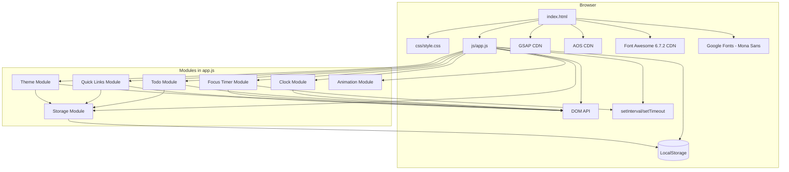
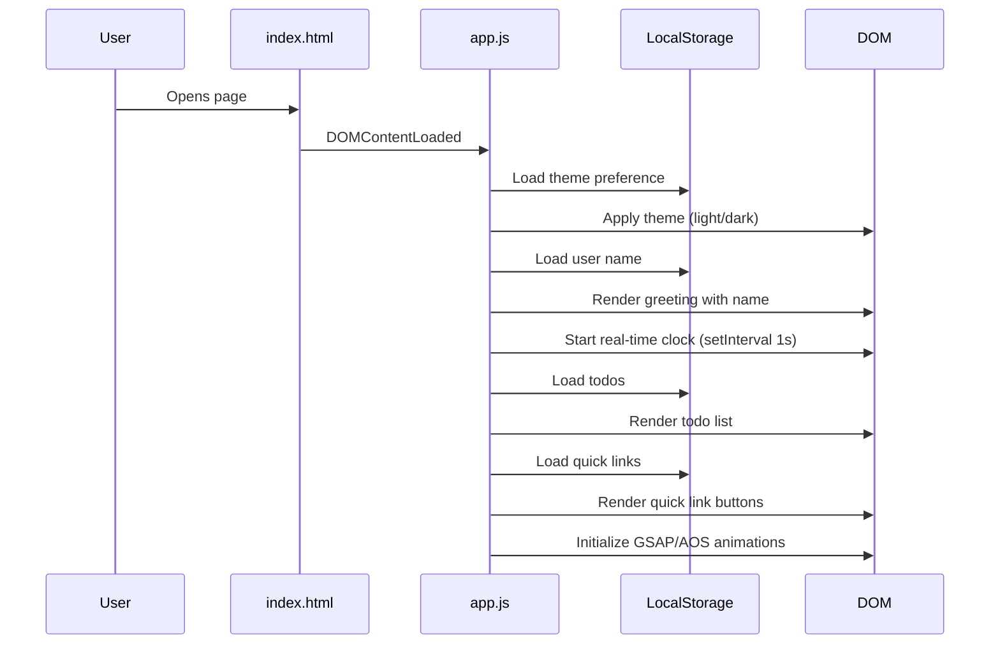
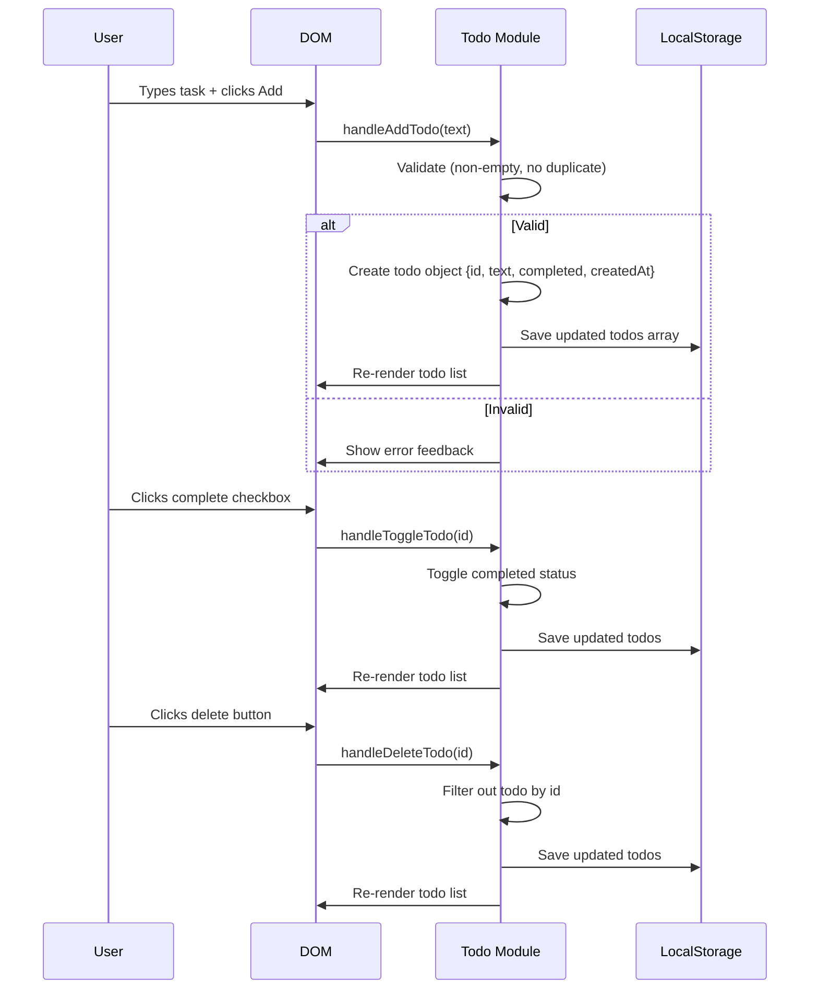
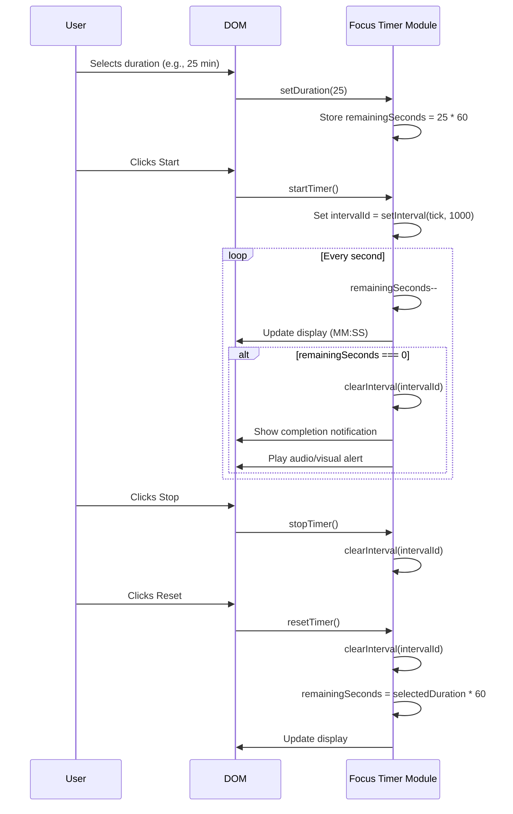

# Design Document: Personal Dashboard

## Overview

The Personal Dashboard is a lightweight, client-side web application that serves as a customizable browser start page or standalone web app. It provides users with a real-time clock with contextual greetings, a Pomodoro-style focus timer, a persistent to-do list, and configurable quick links to frequently visited websites. All data persists via the browser's LocalStorage API, requiring no backend infrastructure.

The application follows an Apple-inspired minimalist design philosophy with glassmorphism effects, smooth GSAP/AOS animations, and a responsive layout built on a 960-grid system with flexbox. It supports both light and dark modes and uses Mona Sans typography with a golden ratio (1.618) scale hierarchy.

The architecture is intentionally simple: a single HTML file, one CSS file (`css/style.css`), and one JavaScript file (`js/app.js`), making it easy to deploy as a static page or package as a browser extension.

## Architecture



## Sequence Diagrams

### App Initialization Flow



### Todo CRUD Flow



### Focus Timer Flow



## Components and Interfaces

### Component 1: Storage Module

**Purpose**: Centralized abstraction over LocalStorage with JSON serialization/deserialization.

**Interface**:
```javascript
const Storage = {
  get(key) { /* returns parsed JSON or default */ },
  set(key, value) { /* serializes and stores */ },
  remove(key) { /* removes key */ }
}
```

**Storage Keys**:
| Key | Type | Description |
|-----|------|-------------|
| `dashboard_username` | `string` | User's display name |
| `dashboard_todos` | `Todo[]` | Array of todo objects |
| `dashboard_links` | `QuickLink[]` | Array of quick link objects |
| `dashboard_theme` | `"light" \| "dark"` | Current theme preference |

**Responsibilities**:
- Serialize/deserialize JSON safely with try-catch
- Provide default values when keys don't exist
- Abstract localStorage API for testability

### Component 2: Clock Module

**Purpose**: Manages real-time clock display and contextual greeting generation.

**Interface**:
```javascript
const Clock = {
  init(containerEl, greetingEl) { /* starts clock interval */ },
  destroy() { /* clears interval */ },
  getGreeting(hour) { /* returns greeting string */ },
  formatTime(date) { /* returns formatted time string */ },
  formatDate(date) { /* returns formatted date string */ }
}
```

**Responsibilities**:
- Update time display every second
- Generate time-based greeting (Morning/Afternoon/Evening/Night)
- Display user's custom name in greeting
- Format date in readable locale string

### Component 3: Todo Module

**Purpose**: Full CRUD management for tasks with persistence and duplicate prevention.

**Interface**:
```javascript
const Todo = {
  init(containerEl) { /* loads and renders todos */ },
  add(text) { /* adds new todo, returns boolean success */ },
  edit(id, newText) { /* updates todo text */ },
  toggle(id) { /* toggles completed status */ },
  delete(id) { /* removes todo */ },
  sort(criteria) { /* sorts by criteria: 'date', 'alpha', 'status' */ },
  getAll() { /* returns current todos array */ }
}
```

**Responsibilities**:
- Add tasks with duplicate detection (case-insensitive)
- Edit task text inline
- Toggle completion status
- Delete tasks with confirmation
- Sort tasks by date, alphabetical, or completion status
- Persist all changes to LocalStorage immediately

### Component 4: Focus Timer Module

**Purpose**: Configurable countdown timer with Pomodoro-style presets.

**Interface**:
```javascript
const FocusTimer = {
  init(containerEl) { /* sets up timer UI */ },
  setDuration(minutes) { /* configures timer duration */ },
  start() { /* begins countdown */ },
  stop() { /* pauses countdown */ },
  reset() { /* resets to selected duration */ },
  getState() { /* returns {running, remaining, duration} */ }
}
```

**Responsibilities**:
- Support preset durations: 1, 5, 10, 15, 20, 25, 30, 45, 60 minutes
- Accurate countdown with setInterval (1 second tick)
- Visual progress indication
- Completion notification (visual alert)
- Prevent multiple simultaneous timers

### Component 5: Quick Links Module

**Purpose**: Manages user's favorite website shortcuts with icon support.

**Interface**:
```javascript
const QuickLinks = {
  init(containerEl) { /* loads and renders links */ },
  add(name, url, icon) { /* adds new quick link */ },
  remove(id) { /* removes quick link */ },
  getAll() { /* returns links array */ }
}
```

**Default Links**:
- Gmail: `https://mail.google.com` (fa-envelope icon)
- GitHub: `https://github.com` (fa-brands fa-github icon)

**Responsibilities**:
- Render link buttons with Font Awesome icons
- Open links in new tab
- Add/remove custom links
- Persist to LocalStorage
- Provide sensible defaults on first load

### Component 6: Theme Module

**Purpose**: Manages light/dark mode toggle with system preference detection.

**Interface**:
```javascript
const Theme = {
  init() { /* loads preference, applies theme */ },
  toggle() { /* switches theme */ },
  get() { /* returns current theme */ }
}
```

**Responsibilities**:
- Detect system color scheme preference on first visit
- Toggle between light and dark modes
- Persist preference to LocalStorage
- Apply CSS custom properties for theme switching

## Data Models

### Model 1: Todo

```javascript
/**
 * @typedef {Object} Todo
 * @property {string} id - Unique identifier (crypto.randomUUID or timestamp-based)
 * @property {string} text - Task description (trimmed, non-empty)
 * @property {boolean} completed - Completion status
 * @property {number} createdAt - Unix timestamp (Date.now())
 */
const todo = {
  id: "a1b2c3d4",
  text: "Complete project documentation",
  completed: false,
  createdAt: 1716700800000
}
```

**Validation Rules**:
- `text` must be non-empty after trimming
- `text` must not duplicate existing todo (case-insensitive comparison)
- `id` must be unique within the todos array
- `createdAt` must be a valid timestamp

### Model 2: QuickLink

```javascript
/**
 * @typedef {Object} QuickLink
 * @property {string} id - Unique identifier
 * @property {string} name - Display name for the link
 * @property {string} url - Full URL (must start with http:// or https://)
 * @property {string} icon - Font Awesome class string (e.g., "fa-brands fa-github")
 */
const quickLink = {
  id: "link1",
  name: "GitHub",
  url: "https://github.com",
  icon: "fa-brands fa-github"
}
```

**Validation Rules**:
- `url` must be a valid URL starting with `http://` or `https://`
- `name` must be non-empty after trimming
- `icon` must be a valid Font Awesome class string

### Model 3: AppState (in-memory)

```javascript
/**
 * @typedef {Object} AppState
 * @property {string} username - User's display name
 * @property {Todo[]} todos - Array of todo items
 * @property {QuickLink[]} links - Array of quick links
 * @property {"light"|"dark"} theme - Current theme
 * @property {Object} timer - Timer state
 * @property {boolean} timer.running - Whether timer is active
 * @property {number} timer.remaining - Seconds remaining
 * @property {number} timer.duration - Selected duration in seconds
 */
```

## Algorithmic Pseudocode

### Main Initialization Algorithm

```javascript
/**
 * ALGORITHM: initializeApp
 * INPUT: none (reads from DOM and LocalStorage)
 * OUTPUT: Fully initialized dashboard
 */
function initializeApp() {
  // Step 1: Initialize theme (must be first to prevent flash)
  const savedTheme = Storage.get('dashboard_theme') 
    || getSystemPreference();
  applyTheme(savedTheme);

  // Step 2: Initialize greeting and clock
  const username = Storage.get('dashboard_username') || 'Friend';
  Clock.init(
    document.getElementById('clock-display'),
    document.getElementById('greeting-display')
  );
  updateGreeting(username);

  // Step 3: Initialize todo list
  Todo.init(document.getElementById('todo-container'));

  // Step 4: Initialize focus timer
  FocusTimer.init(document.getElementById('timer-container'));

  // Step 5: Initialize quick links
  QuickLinks.init(document.getElementById('links-container'));

  // Step 6: Initialize animations
  AOS.init({ duration: 800, easing: 'ease-out-cubic', once: true });
  initGSAPAnimations();

  // Step 7: Bind global event listeners
  bindThemeToggle();
  bindNameEditor();
}

document.addEventListener('DOMContentLoaded', initializeApp);
```

### Todo Duplicate Detection Algorithm

```javascript
/**
 * ALGORITHM: isDuplicate
 * INPUT: text (string) - the new todo text to check
 * INPUT: todos (Todo[]) - existing todos array
 * OUTPUT: boolean - true if duplicate exists
 * 
 * PRECONDITIONS:
 *   - text is trimmed and non-empty
 *   - todos is a valid array (may be empty)
 * 
 * POSTCONDITIONS:
 *   - Returns true if any existing todo has same text (case-insensitive)
 *   - No mutation of input parameters
 */
function isDuplicate(text, todos) {
  const normalizedInput = text.toLowerCase().trim();
  return todos.some(todo => 
    todo.text.toLowerCase().trim() === normalizedInput
  );
}
```

### Todo Sort Algorithm

```javascript
/**
 * ALGORITHM: sortTodos
 * INPUT: todos (Todo[]) - array to sort
 * INPUT: criteria ('date' | 'alpha' | 'status') - sort method
 * OUTPUT: Todo[] - new sorted array
 * 
 * PRECONDITIONS:
 *   - todos is a valid array
 *   - criteria is one of the valid sort options
 * 
 * POSTCONDITIONS:
 *   - Returns new array (no mutation of original)
 *   - Array contains same elements, different order
 *   - Stable sort maintained for equal elements
 */
function sortTodos(todos, criteria) {
  const sorted = [...todos];
  
  switch (criteria) {
    case 'date':
      // Newest first
      sorted.sort((a, b) => b.createdAt - a.createdAt);
      break;
    case 'alpha':
      // Alphabetical A-Z (case-insensitive)
      sorted.sort((a, b) => 
        a.text.toLowerCase().localeCompare(b.text.toLowerCase())
      );
      break;
    case 'status':
      // Incomplete first, then completed
      sorted.sort((a, b) => {
        if (a.completed === b.completed) return 0;
        return a.completed ? 1 : -1;
      });
      break;
  }
  
  return sorted;
}
```

### Focus Timer Tick Algorithm

```javascript
/**
 * ALGORITHM: tick
 * INPUT: state (TimerState) - current timer state (mutated)
 * OUTPUT: void (side effects: updates DOM, triggers completion)
 * 
 * PRECONDITIONS:
 *   - state.running === true
 *   - state.remaining >= 0
 *   - Timer interval is active
 * 
 * POSTCONDITIONS:
 *   - state.remaining decremented by 1 (if > 0)
 *   - DOM display updated to reflect new time
 *   - If remaining reaches 0: timer stops, completion triggered
 * 
 * LOOP INVARIANT:
 *   - state.remaining >= 0 at all times
 *   - Display always shows current state.remaining formatted as MM:SS
 */
function tick(state) {
  if (state.remaining <= 0) {
    stopTimer(state);
    onTimerComplete();
    return;
  }
  
  state.remaining--;
  updateTimerDisplay(state.remaining);
}

/**
 * ALGORITHM: formatTimerDisplay
 * INPUT: totalSeconds (number) - seconds remaining
 * OUTPUT: string - formatted as "MM:SS"
 * 
 * PRECONDITIONS:
 *   - totalSeconds >= 0
 *   - totalSeconds <= 3600 (max 60 minutes)
 * 
 * POSTCONDITIONS:
 *   - Returns string in format "MM:SS"
 *   - Minutes and seconds zero-padded to 2 digits
 */
function formatTimerDisplay(totalSeconds) {
  const minutes = Math.floor(totalSeconds / 60);
  const seconds = totalSeconds % 60;
  return `${String(minutes).padStart(2, '0')}:${String(seconds).padStart(2, '0')}`;
}
```

### Greeting Generation Algorithm

```javascript
/**
 * ALGORITHM: getGreeting
 * INPUT: hour (number) - current hour (0-23)
 * OUTPUT: string - contextual greeting
 * 
 * PRECONDITIONS:
 *   - 0 <= hour <= 23
 * 
 * POSTCONDITIONS:
 *   - Returns appropriate greeting for time of day
 *   - Morning: 5-11, Afternoon: 12-17, Evening: 18-21, Night: 22-4
 */
function getGreeting(hour) {
  if (hour >= 5 && hour < 12) return 'Good Morning';
  if (hour >= 12 && hour < 18) return 'Good Afternoon';
  if (hour >= 18 && hour < 22) return 'Good Evening';
  return 'Good Night';
}
```

### Theme Toggle Algorithm

```javascript
/**
 * ALGORITHM: toggleTheme
 * INPUT: none (reads current state)
 * OUTPUT: void (side effects: updates DOM and LocalStorage)
 * 
 * PRECONDITIONS:
 *   - document.documentElement exists
 *   - Storage module is initialized
 * 
 * POSTCONDITIONS:
 *   - Theme switched from light→dark or dark→light
 *   - CSS custom properties updated via data-theme attribute
 *   - New preference persisted to LocalStorage
 */
function toggleTheme() {
  const current = document.documentElement.getAttribute('data-theme');
  const next = current === 'dark' ? 'light' : 'dark';
  
  document.documentElement.setAttribute('data-theme', next);
  Storage.set('dashboard_theme', next);
}
```

## Key Functions with Formal Specifications

### Function: Storage.get()

```javascript
function get(key, defaultValue = null) {
  try {
    const raw = localStorage.getItem(key);
    return raw !== null ? JSON.parse(raw) : defaultValue;
  } catch (e) {
    console.warn(`Storage.get failed for key "${key}":`, e);
    return defaultValue;
  }
}
```

**Preconditions:**
- `key` is a non-empty string
- `defaultValue` can be any serializable value

**Postconditions:**
- Returns parsed JSON value if key exists and is valid JSON
- Returns `defaultValue` if key doesn't exist or parsing fails
- Never throws an exception

### Function: Todo.add()

```javascript
function add(text) {
  const trimmed = text.trim();
  if (!trimmed) return { success: false, error: 'EMPTY_TEXT' };
  if (isDuplicate(trimmed, todos)) return { success: false, error: 'DUPLICATE' };
  
  const newTodo = {
    id: crypto.randomUUID(),
    text: trimmed,
    completed: false,
    createdAt: Date.now()
  };
  
  todos.push(newTodo);
  Storage.set('dashboard_todos', todos);
  render();
  return { success: true, todo: newTodo };
}
```

**Preconditions:**
- `text` is a string (may contain whitespace)
- `todos` array is loaded from storage

**Postconditions:**
- If text is empty after trim: returns error, no state change
- If duplicate exists: returns error, no state change
- If valid: new todo added, persisted, UI re-rendered
- Todo array length increases by exactly 1 on success

**Loop Invariants:** N/A

### Function: QuickLinks.add()

```javascript
function add(name, url, icon = 'fa-solid fa-link') {
  const trimmedName = name.trim();
  const trimmedUrl = url.trim();
  
  if (!trimmedName) return { success: false, error: 'EMPTY_NAME' };
  if (!isValidUrl(trimmedUrl)) return { success: false, error: 'INVALID_URL' };
  
  const newLink = {
    id: crypto.randomUUID(),
    name: trimmedName,
    url: trimmedUrl,
    icon: icon
  };
  
  links.push(newLink);
  Storage.set('dashboard_links', links);
  render();
  return { success: true, link: newLink };
}
```

**Preconditions:**
- `name` is a string
- `url` is a string
- `icon` is a valid Font Awesome class string (optional, has default)

**Postconditions:**
- If name empty: returns error, no state change
- If URL invalid: returns error, no state change
- If valid: new link added, persisted, UI re-rendered

## Example Usage

```javascript
// Example 1: App initialization on page load
document.addEventListener('DOMContentLoaded', () => {
  initializeApp();
});

// Example 2: Adding a todo
const result = Todo.add('Review pull request');
if (!result.success) {
  showToast(`Cannot add: ${result.error}`);
}

// Example 3: Starting a 25-minute focus session
FocusTimer.setDuration(25);
FocusTimer.start();

// Example 4: Adding a quick link
QuickLinks.add('YouTube', 'https://youtube.com', 'fa-brands fa-youtube');

// Example 5: Toggling theme
document.getElementById('theme-toggle').addEventListener('click', () => {
  Theme.toggle();
});

// Example 6: Setting user name
document.getElementById('name-input').addEventListener('change', (e) => {
  const name = e.target.value.trim() || 'Friend';
  Storage.set('dashboard_username', name);
  updateGreeting(name);
});

// Example 7: Sorting todos
document.getElementById('sort-select').addEventListener('change', (e) => {
  Todo.sort(e.target.value); // 'date', 'alpha', or 'status'
});
```

## Correctness Properties

*A property is a characteristic or behavior that should hold true across all valid executions of a system—essentially, a formal statement about what the system should do. Properties serve as the bridge between human-readable specifications and machine-verifiable correctness guarantees.*

### Property 1: Greeting correctness by hour

*For any* hour value between 0 and 23, the getGreeting function SHALL return the correct greeting for that hour's time bracket: "Good Morning" for hours 5–11, "Good Afternoon" for hours 12–17, "Good Evening" for hours 18–21, and "Good Night" for hours 22–4 (wrapping midnight).

**Validates: Requirements 2.1, 2.2, 2.3, 2.4**

### Property 2: Greeting includes custom name

*For any* non-empty string used as a username, the rendered greeting SHALL contain that exact string.

**Validates: Requirement 2.5**

### Property 3: Adding a valid todo grows the list

*For any* non-empty, non-duplicate task description, adding it to the todo list SHALL increase the list length by exactly one and the new item SHALL appear in the list.

**Validates: Requirement 3.1**

### Property 4: Whitespace-only todos are rejected

*For any* string composed entirely of whitespace characters (spaces, tabs, newlines), attempting to add it as a todo SHALL be rejected and the todo list SHALL remain unchanged.

**Validates: Requirement 3.2**

### Property 5: Duplicate todos are rejected (case-insensitive)

*For any* existing todo item and any case variation of its text, attempting to add the case variation SHALL be rejected and the todo list SHALL remain unchanged.

**Validates: Requirement 3.3**

### Property 6: Todo toggle is a round-trip

*For any* todo item, toggling its completion status twice SHALL return it to its original completion state.

**Validates: Requirement 3.4**

### Property 7: Todo deletion removes exactly one item

*For any* todo list containing at least one item, deleting a specific item SHALL reduce the list length by exactly one and that item's id SHALL no longer appear in the list.

**Validates: Requirement 3.5**

### Property 8: Sort preserves all elements

*For any* todo list and any valid sort criteria (date, alpha, status), sorting SHALL produce a list of the same length containing exactly the same set of todo items (no data loss, no duplication).

**Validates: Requirement 3.7**

### Property 9: Timer display format

*For any* integer value of seconds between 0 and 3600, the formatTimerDisplay function SHALL produce a string matching the pattern "MM:SS" where MM is zero-padded minutes and SS is zero-padded seconds.

**Validates: Requirement 4.2**

### Property 10: Timer bounds invariant

*For any* sequence of timer operations (start, tick, stop, reset), the remaining time SHALL always be greater than or equal to zero and less than or equal to the selected duration.

**Validates: Requirements 4.3, 4.8**

### Property 11: Timer reset restores duration

*For any* timer state (running or stopped) with any remaining time, calling reset SHALL set the remaining time back to exactly the selected duration.

**Validates: Requirement 4.6**

### Property 12: URL validation rejects non-http protocols

*For any* string that does not start with "http://" or "https://", the URL validation SHALL reject it, preventing addition as a quick link.

**Validates: Requirements 5.3, 10.2**

### Property 13: Empty link name is rejected

*For any* string composed entirely of whitespace characters, attempting to add it as a quick link name SHALL be rejected.

**Validates: Requirement 5.4**

### Property 14: Link removal decreases count

*For any* quick links list containing at least one item, removing a specific link SHALL reduce the list length by exactly one and that link's id SHALL no longer appear in the list.

**Validates: Requirement 5.6**

### Property 15: Theme toggle round-trip

*For any* initial theme state (light or dark), toggling the theme twice SHALL return to the original theme state, and the stored preference SHALL match the displayed theme after each toggle.

**Validates: Requirements 6.2, 6.3, 6.5**

### Property 16: Storage serialization round-trip

*For any* JSON-serializable JavaScript value (objects, arrays, strings, numbers, booleans, null), storing it via Storage.set and retrieving it via Storage.get SHALL produce a value equivalent to the original.

**Validates: Requirements 7.1, 7.2, 3.8, 5.7**

### Property 17: Storage resilience to corrupted data

*For any* non-JSON string stored directly in localStorage under a dashboard key, calling Storage.get SHALL return the specified default value without throwing an exception.

**Validates: Requirement 7.3**

### Property 18: XSS prevention via text rendering

*For any* string containing HTML tags or script elements, rendering it as todo text or link name SHALL produce DOM output where the string appears as literal text (not interpreted as HTML).

**Validates: Requirement 10.1**

## Error Handling

### Error Scenario 1: LocalStorage Unavailable

**Condition**: Browser in private mode or storage quota exceeded
**Response**: App functions with in-memory state only; shows subtle warning indicator
**Recovery**: All features work normally but data won't persist across sessions

### Error Scenario 2: Corrupted Storage Data

**Condition**: JSON.parse fails on stored data (manual tampering or corruption)
**Response**: Storage.get returns default value; logs warning to console
**Recovery**: App reinitializes with defaults; user can re-enter data

### Error Scenario 3: Invalid URL in Quick Links

**Condition**: User enters malformed URL
**Response**: Validation rejects input; shows inline error message
**Recovery**: User corrects URL format; form remains populated for editing

### Error Scenario 4: Duplicate Todo Attempt

**Condition**: User tries to add a task that already exists (case-insensitive match)
**Response**: Addition rejected; shows toast notification explaining duplicate
**Recovery**: User can modify text to make it unique

### Error Scenario 5: Timer Already Running

**Condition**: User clicks Start while timer is already active
**Response**: Start button disabled/hidden while timer runs; only Stop/Reset available
**Recovery**: User must stop or wait for completion before starting new session

## Testing Strategy

### Unit Testing Approach

Key test cases for each module:
- **Storage**: get/set/remove with valid data, corrupted data, missing keys
- **Clock**: getGreeting for boundary hours (4→5, 11→12, 17→18, 21→22)
- **Todo**: add (valid, empty, duplicate), edit, toggle, delete, sort (all criteria)
- **FocusTimer**: setDuration, start/stop/reset state transitions, tick countdown
- **QuickLinks**: add (valid, invalid URL, empty name), remove, defaults loading
- **Theme**: toggle, system preference detection, persistence

### Property-Based Testing Approach

**Property Test Library**: fast-check

See the **Correctness Properties** section above for the full list of 18 formal properties to verify via property-based testing. Key areas covered include greeting logic, todo CRUD invariants, timer bounds, URL validation, theme toggling, and storage round-trips.

### Integration Testing Approach

- Full initialization flow: page load → all modules render correctly
- Todo lifecycle: add → edit → complete → delete
- Timer lifecycle: set duration → start → tick → complete
- Theme persistence: toggle → reload → theme preserved
- Cross-module: adding todo while timer is running doesn't interfere

## Performance Considerations

- **Single repaint strategy**: Batch DOM updates using DocumentFragment for todo list rendering
- **Debounced storage writes**: Avoid excessive localStorage writes during rapid interactions
- **Efficient clock updates**: Only update DOM text nodes, not rebuild elements every second
- **CSS animations over JS**: Use CSS transitions for hover/focus states; reserve GSAP for entrance animations
- **Lazy AOS initialization**: Initialize AOS after critical content is rendered
- **Minimal reflows**: Use `transform` and `opacity` for animations (GPU-composited properties)
- **Event delegation**: Single event listener on todo container instead of per-item listeners

## Security Considerations

- **XSS Prevention**: All user input (todo text, link names, URLs) must be escaped before DOM insertion using `textContent` instead of `innerHTML`
- **URL Validation**: Quick link URLs validated against allowlist of protocols (http/https only) to prevent `javascript:` injection
- **No eval()**: Never use eval or Function constructor on stored data
- **Content Security Policy**: If deployed, recommend CSP headers allowing only CDN sources for GSAP, AOS, Font Awesome, and Google Fonts
- **LocalStorage limits**: Gracefully handle QuotaExceededError when storage is full

## Dependencies

| Dependency | Version | Purpose | CDN |
|-----------|---------|---------|-----|
| GSAP | Latest | Typography art animations, entrance effects | cdnjs/gsap |
| AOS | 2.3.4 | Scroll-triggered reveal animations | cdnjs/aos |
| Font Awesome | 6.7.2 | Quick link icons | cdnjs/font-awesome |
| Mona Sans | Latest | Primary typeface (Google Fonts) | fonts.google.com |

**No npm/node dependencies required.** All external libraries loaded via CDN `<script>` and `<link>` tags.

## CSS Architecture

### Custom Properties (Theme System)

```css
:root[data-theme="light"] {
  --bg-primary: #f5f5f7;
  --bg-card: rgba(255, 255, 255, 0.72);
  --text-primary: #1d1d1f;
  --text-secondary: #6e6e73;
  --accent: #0071e3;
  --border: rgba(0, 0, 0, 0.08);
  --shadow: 0 8px 32px rgba(0, 0, 0, 0.08);
  --blur: 20px;
}

:root[data-theme="dark"] {
  --bg-primary: #1d1d1f;
  --bg-card: rgba(44, 44, 46, 0.72);
  --text-primary: #f5f5f7;
  --text-secondary: #a1a1a6;
  --accent: #2997ff;
  --border: rgba(255, 255, 255, 0.08);
  --shadow: 0 8px 32px rgba(0, 0, 0, 0.32);
  --blur: 20px;
}
```

### Typography Scale (Golden Ratio 1.618)

```css
/* Base: 16px */
--font-xs: 0.618rem;   /* ~10px */
--font-sm: 0.786rem;   /* ~12.6px */
--font-base: 1rem;     /* 16px */
--font-md: 1.272rem;   /* ~20.3px */
--font-lg: 1.618rem;   /* ~25.9px */
--font-xl: 2.618rem;   /* ~41.9px */
--font-2xl: 4.236rem;  /* ~67.8px */
```

### Glassmorphism Card Pattern

```css
.card {
  background: var(--bg-card);
  backdrop-filter: blur(var(--blur));
  -webkit-backdrop-filter: blur(var(--blur));
  border: 1px solid var(--border);
  border-radius: 16px;
  box-shadow: var(--shadow);
}
```

## Responsive Breakpoints

```css
/* Mobile first approach */
/* Small: default (< 640px) */
/* Medium: 640px+ */
/* Large: 960px+ (960 grid) */
/* XL: 1280px+ */

@media (min-width: 640px) { /* tablet */ }
@media (min-width: 960px) { /* desktop - 960 grid */ }
@media (min-width: 1280px) { /* large desktop */ }
```

## File Structure

```
personal-dashboard/
├── index.html          # Single HTML file with all sections
├── css/
│   └── style.css       # Single CSS file (themes, layout, components)
├── js/
│   └── app.js          # Single JS file (all modules in IIFE/module pattern)
└── README.md           # Documentation
```
